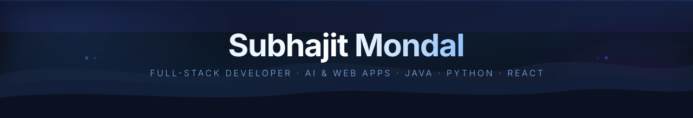

<!-- HEADER BANNER -->

  

<!-- TITLE -->
Hi, I'm Subhajit Mondal 👋

> Final-year B.Tech CSE @ RCCIIT · Building AI-powered web apps · Open to SDE roles

📍 Kolkata, WB  |  📧 subhajitm1560@gmail.com  | 
🔗 [LinkedIn](https://linkedin.com/in/thesubhajitmondal)

---

<!-- ABOUT -->
## About me

I'm a full-stack developer with a strong focus on AI-integrated applications and modern web development. Currently building an **AI Code Review Bot** using FastAPI + Gemini 2.5 Flash + Next.js 14, and recently shipped an **AI Health Assistant** with multilingual RAG, MedGemma inference, and Twilio WhatsApp integration. Actively preparing for SDE placements with Java + DSA.

- 🔭 Currently working on: AI Code Review Bot (FastAPI + Gemini + Next.js 14)
- 🌱 Learning: Advanced DSA in Java, System Design
- 💼 Interned at: VaultofCodes & Edunet Foundation (2025)
- 🏅 Certified: Oracle OCI GenAI Professional · Oracle OCI AI Foundations

---

<!-- TECH STACK -->
## Tech stack

**Languages**

**Frontend**

**Backend & AI**

---

<!-- PROJECTS -->
## Featured projects

### AI Health Assistant
> Multilingual clinical Q&A chatbot with RAG pipeline and WhatsApp integration

- **Stack**: FastAPI · PostgreSQL · React/Vite · FAISS · MedGemma · Twilio
- RAG pipeline using sentence-transformers + FAISS over curated medical documents
- Twilio WhatsApp messaging with optional gTTS voice replies and vaccination reminders
- Local (Uvicorn/ngrok) and cloud-ready deployment

### AI Code Review Bot
> Developer tool for automated code quality analysis using Google Gemini 2.5 Flash

- **Stack**: FastAPI · Next.js 14 · Tailwind CSS · Shadcn UI · Google Gemini API
- Luxury dark editorial UI inspired by Linear/Vercel/Railway aesthetic
- Detects bugs, code smells, and suggests improvements in real-time

### Weather Application
> Responsive weather app with real-time API data and theme toggling

- **Stack**: HTML · CSS · JavaScript · OpenWeatherMap API
- Dark/light theme toggle, live air quality index and UV gauges

---

<!-- CERTIFICATIONS -->
## Certifications

| Certification | Issuer | Year |
|---|---|---|
| OCI GenAI Professional | Oracle | 2025 |
| OCI AI Foundations Associate | Oracle | 2025 |
| MySQL HeatWave Certified | Oracle | 2025 |
| Full Stack Developer Bootcamp | GeeksforGeeks | 2025 |
| Web Development Fundamentals | IBM | 2025 |

---

<!-- GITHUB STATS -->
## GitHub stats

  

---

<!-- CTA -->

  Open to SDE internships, full-time roles, and collaborations on AI/fullstack projects. 
  📬 <a href="mailto:subhajitm1560@gmail.com">subhajitm1560@gmail.com</a> &nbsp;|&nbsp;
  💼 <a href="https://linkedin.com/in/thesubhajitmondal">LinkedIn</a>
  

